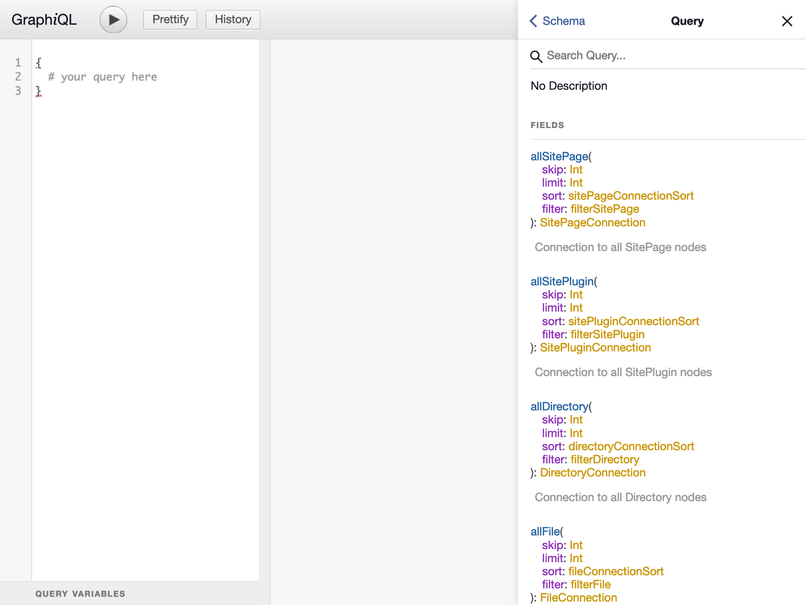
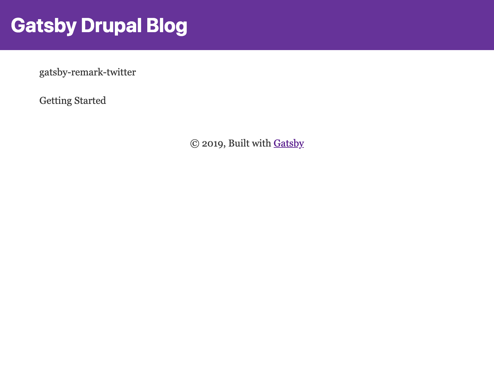
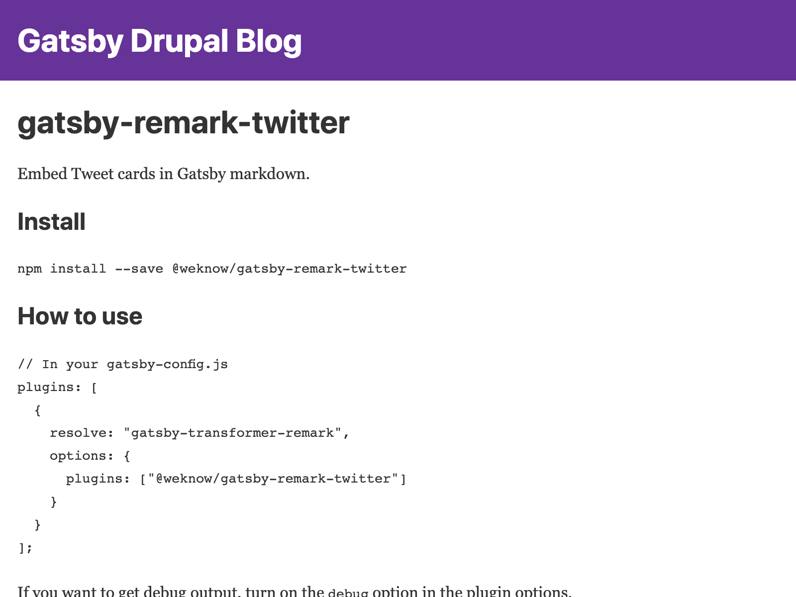

Time to take our initial project structure from Lab One and expand upon it, building out some more useful functionality. By the end of this lab, we will have implemented the following functionality:

- Add a few blog posts to Drupal
- Query for _all_ Drupal blog posts on our index page
- Implement a blog post template with Gatsby (a React component!)
- Query for a specific blog post and route to it

As this functionality is fairly complex, we'll be breaking this lab into two parts. Part One will focus on editing the Drupal-exposed CMS for the necessary posts and then displaying those posts from Gatsby with React and GraphQL. Part Two will focus on implementing the page template and displaying a specific blog post. At the outset, you'll have a mostly functional blog powered by Drupal and Gatsby!

## Part One

As noted--let's start with editing our Drupal CMS with a few post types. Feel free to use the following as examples, or perhaps write your own, or perhaps even something like [Hipster Ipsum](https://hipsum.co/)

<details>
  <summary>Sample Post One</summary>

  ```md
  Far far away, behind the word mountains, far from the countries Vokalia and
  Consonantia, there live the blind texts. Separated they live in Bookmarksgrove
  right at the coast of the Semantics, a large language ocean. A small river named
  Duden flows by their place and supplies it with the necessary regelialia.

  ## On deer horse aboard tritely yikes and much

  The Big Oxmox advised her not to do so, because there were thousands of bad
  Commas, wild Question Marks and devious Semikoli, but the Little Blind Text
  didn’t listen. She packed her seven versalia, put her initial into the belt and
  made herself on the way.

  - This however showed weasel
  - Well uncritical so misled
    - this is very interesting
  - Goodness much until that fluid owl

  When she reached the first hills of the **Italic Mountains**, she had a last
  view back on the skyline of her hometown _Bookmarksgrove_, the headline of
  [Alphabet Village](http://google.com) and the subline of her own road, the Line
  Lane. Pityful a rethoric question ran over her cheek, then she continued her
  way. On her way she met a copy.

  ### Overlaid the jeepers uselessly much excluding

  But nothing the copy said could convince her and so it didn’t take long until a
  few insidious Copy Writers ambushed her, made her drunk with
  [Longe and Parole](http://google.com) and dragged her into their agency, where
  they abused her for their projects again and again. And if she hasn’t been
  rewritten, then they are still using her.

  > Far far away, behind the word mountains, far from the countries Vokalia and
  > Consonantia, there live the blind texts. Separated they live in Bookmarksgrove
  > right at the coast of the Semantics, a large language ocean.

  It is a paradisematic country, in which roasted parts of sentences fly into your
  mouth. Even the all-powerful Pointing has no control about the blind texts it is
  an almost unorthographic life One day however a small line of blind text by the
  name of Lorem Ipsum decided to leave for the far World of Grammar.

  ### According a funnily until pre-set or arrogant well cheerful

  The Big Oxmox advised her not to do so, because there were thousands of bad
  Commas, wild Question Marks and devious Semikoli, but the Little Blind Text
  didn’t listen. She packed her seven versalia, put her initial into the belt and
  made herself on the way.

  1.  So baboon this
  2.  Mounted militant weasel gregariously admonishingly straightly hey
  3.  Dear foresaw hungry and much some overhung
  4.  Rash opossum less because less some amid besides yikes jeepers frenetic
      impassive fruitlessly shut

  When she reached the first hills of the Italic Mountains, she had a last view
  back on the skyline of her hometown Bookmarksgrove, the headline of Alphabet
  Village and the subline of her own road, the Line Lane. Pityful a rethoric
  question ran over her cheek, then she continued her way. On her way she met a
  copy.

  > The copy warned the Little Blind Text, that where it came from it would have
  > been rewritten a thousand times and everything that was left from its origin
  > would be the word "and" and the Little Blind Text should turn around and
  > return to its own, safe country.

  But nothing the copy said could convince her and so it didn’t take long until a
  few insidious Copy Writers ambushed her, made her drunk with Longe and Parole
  and dragged her into their agency, where they abused her for their projects
  again and again. And if she hasn’t been rewritten, then they are still using
  her. Far far away, behind the word mountains, far from the countries Vokalia and
  Consonantia, there live the blind texts.

  #### Silent delightfully including because before one up barring chameleon

  Separated they live in Bookmarksgrove right at the coast of the Semantics, a
  large language ocean. A small river named Duden flows by their place and
  supplies it with the necessary regelialia. It is a paradisematic country, in
  which roasted parts of sentences fly into your mouth.

  Even the all-powerful Pointing has no control about the blind texts it is an
  almost unorthographic life One day however a small line of blind text by the
  name of Lorem Ipsum decided to leave for the far World of Grammar. The Big Oxmox
  advised her not to do so, because there were thousands of bad Commas, wild
  Question Marks and devious Semikoli, but the Little Blind Text didn’t listen.

  ##### Wherever far wow thus a squirrel raccoon jeez jaguar this from along

  She packed her seven versalia, put her initial into the belt and made herself on
  the way. When she reached the first hills of the Italic Mountains, she had a
  last view back on the skyline of her hometown Bookmarksgrove, the headline of
  Alphabet Village and the subline of her own road, the Line Lane. Pityful a
  rethoric question ran over her cheek, then she continued her way. On her way she
  met a copy.

  ###### Slapped cozy a that lightheartedly and far

  The copy warned the Little Blind Text, that where it came from it would have
  been rewritten a thousand times and everything that was left from its origin
  would be the word "and" and the Little Blind Text should turn around and return
  to its own, safe country. But nothing the copy said could convince her and so it
  didn’t take long until a few insidious Copy Writers ambushed her, made her drunk
  with Longe and Parole and dragged her into their agency, where they abused her
  for their projects again and again.
  ```
</details>

<details>
  <summary>Sample Post Two</summary>

  ```md
  Wow! I love blogging so much already.

  Did you know that "despite its name, salted duck eggs can also be made from
  chicken eggs, though the taste and texture will be somewhat different, and the
  egg yolk will be less rich."?
  ([Wikipedia Link](http://en.wikipedia.org/wiki/Salted_duck_egg))

  Yeah, I didn't either.
  ```
</details>

Use the provided credentials and hosted copy you created in [Part One](/labs/01-set-up/) and log on to the Drupal CMS.

<!-- TODO: Screenshots for Drupal CMS -->

Woo hoo! You've created your first few couple of blog posts. We now need to query these blog posts with our exposed GraphQL schema utilizing GrapiQL (a pseudo IDE for editing GraphQL queries).

## Using GraphiQL

The first step that needs to be done is start the local development server, which will expose GraphiQL, a live editing build server, and some nice functionality like hot reloading 🔥.

First, ensure you're in the second lab by changing to the directory:

```shell
cd labs/02-querying-drupal/ # presuming at the root
```

Next, start the development server:

```shell
yarn start
```

This will expose a local development server at `http://localhost:8000` _and_ it will also expose a GraphQL schema which can be accessed at `http://localhost:8000/___graphql` (three underscores!). It will look something like this:



The left pane is the query tab. It can be used to query and then see the results of the query when the "Play" button is pressed. Additionally, the schema (Docs) tab can be opened to inspect the local GraphQL schema to see what's available.

From this point, we want to query for all of our blog posts, so that we can display them on our blog's home page (`/`). Play around a bit, and see if you can find the correct query! A hint: Gatsby and the `gatsby-plugin-drupal` use a convention of using the prefix `all` (e.g. `allMarkdownRemark`) to denote _all_ forms of some content.

<details>
  <summary>If you need a little nudge!</summary>

  ```graphql
  query GetAllBlogPosts {
    allNodeArticle {
      edges {
        node {
          title
          fields {
            slug
          }
        }
      }
    }
  }
  ```
</details>

### Editing the Index Page

Now that we have our GraphQL query we can use it to display a listing of all of our blog posts!

We'll be editing a React component and adding a [page query](https://www.gatsbyjs.org/docs/querying-with-graphql/#what-does-a-graphql-query-look-like). Fun!

Open up `src/pages/index.js`, we'll be making _all_ of our changes for Part One within this file.

You'll want to do the following:

1. Add the GraphQL query from the previous step (to get all blog posts!)
1. _Use_ the injected data in the React component with the `data` prop
    - Remember that the shape of a GraphQL query directly matches what is available
    - e.g. `data.allDrupalBlogPost.edges` will be an _array_ that you can iterate over
1. Output a list of blog posts as JSX
    - Consider using `ul` and `li` component(s) to iterate cleanly over these posts

```jsx:title=src/pages/index.js
import React from 'react'
import { graphql } from 'gatsby'

import Layout from '../components/layout'
import SEO from '../components/seo'

export default function IndexPage({ data }) {
  return (
    <Layout>
      <SEO title="Your Great Blog" description="All my blog posts" />
      {/* Add the post listing here. Use data! */}
    </Layout>
  )
}

export const indexQuery = graphql`
  # your query from GraphiQL goes here
`
```

<details>
  <summary>Need to peek?</summary>

  ```jsx:title=src/pages/index.js
  import React from 'react'
  import { graphql } from 'gatsby'

  import Layout from '../components/layout'
  import SEO from '../components/seo'

  export default function IndexPage({ data }) {
    return (
      <Layout>
        <SEO title="Your Great Blog" description="All my blog posts" />
        <ul>
          {
            data.articles.edges.map(({ node }) => (
              <li key={node.title}>
                {node.title}
              </li>
            ))
          }
        </ul>
      </Layout>
    )
  }

  export const indexQuery = graphql`
    query GetAllBlogPosts {
      allNodeArticle {
        edges {
          node {
            title
          }
        }
      }
    }
  `
  ```
</details>

Woo hoo! If you see some posts like below you know that you are officially done with Part One of this lab!



## Part Two: The Big Leagues

In Part Two, we want to expand upon some concepts we've touched upon in Part One. Specifically, we'll be invoking some Gatsby APIs and creating pages dynamically. We'll also update our Index page to link to these new components. Let's get to it!

### Creating a custom blog post template

First, we need to create our templates directory and our blog post template React component.

```shell
mkdir -p src/templates
touch src/templates/article.js
```

On a non-Unix based filesystem, feel free to just create/edit this file and folder structure with your code editor or manually with the Explorer.

Once created, we'll want to give life to this component. Paste the following content into your version of `src/templates/article.js`:

```jsx:title=src/templates/article.js
import React from 'react'

import Layout from '../components/layout'
import SEO from '../components/seo'

export default function BlogPost() {
  return (
    <Layout>
      <SEO title="Blog post" description="An amazing blog post!" />
      <h1>This is a blog post!</h1>
    </Layout>
  )
}
```

Now we need a way to _dynamically_ create pages, and we'll use this template to create those pages. Wouldn't you believe it, we have a way to do this cleanly and easily with Gatsby. Introducing the Node.js API with Gatsby.

#### `gatsby-node.js`

This file is where we invoke and expose our Node.js APIs. These are invoked at build-time during the appropriate phase(s). In this part of the lab, we will be using the `createPages` API. This API exposes a few utility methods, particularly one called `createPage` that will let us dynamically create pages based upon some arbitrary data--e.g. data from our GraphQL schema.

We will want to do several things in this file, particularly with the `createPages` API:

- Query for all blog posts (we can re-use something here)
- Use this data to create a page based on a route and our blog post template

```js:title=gatsby-node.js
const path = require('path')

exports.createPages = async function createPages({ actions, graphql }) {
  const { createPage } = actions

  const result = await graphql(`
    {
      # your query here
      # Remember: you want some unique identifier (a slug!) rather than your existing query
      # GraphiQL is super helpful here :)
    }
  `)
    .then(res => {
      if (res.errors) {
        throw res.errors
      }
      return res.data
    })

  // iterate over your posts, calling createPage for _each_ post
}
```

consider the following snippet for the `createPage` action:

```js
const articleTemplate = path.resolve('src/templates/article.js')

const slug = `/blog/1234`

createPage({
  component: articleTemplate,
  path: slug,
  context: {
    slug
  }
})
```

<details>
  <summary>If you need a little... push!</summary>

  ```js
  const path = require('path')

  exports.createPages = async function createPages({ actions, graphql }) {
    const { createPage } = actions

    const result = await graphql(`
      {
        # your query here
      }
    `)
      .then(res => {
        if (res.errors) {
          throw res.errors
        }
        return res.data
      })

    const blogPostTemplate = path.resolve('src/templates/article.js')

    result.allNodeArticle.edges.forEach(({ node }) => {
      createPage({
        component: blogPostTemplate,
        path: node.fields.slug,
        context: {
          slug: node.fields.slug
        }
      })
    })
  }
  
  ```
</details>

This will create pages at the specified path, that can now be navigated to and will invoke the BlogPost template we previously created. Neat!

### Editing `src/pages/index.js`

We want to be able to route to these posts, so we'll want to edit this page with two tweaks:

- We want to query for a slug, just like we've done in `gatsby-node.js`
- We want to use the `Link` component from `gatsby` to link to a post
    - The `Link` component takes a `to` prop, e.g. `<Link to="/about">About</About>` will link to `/about`.
    - The `Link` component is imported like so:
        ```jsx
        import { Link } from 'gatsby'
        ```

You will be successful if you can (still!) display your listing of all posts, but _now_ clicking one of the posts will link to one of your posts! If you can link to a post, you can move on to the next step! At this point, we want to augment our BlogPost template so that we can actually _display_ a post in more detail!

### Updating the BlogPost template

Similarly to page components, template components can _also_ invoke GraphQL queries. If you'll remember, we used a `context` argument to our `createPage` call. This makes whatever variables you passed available to be queried against. For instance, if we added a slug to our `createPage` context argument, we could use it like so:

```graphql
export const blogPostQuery = graphql`
  query GetArticleBySlug($slug: String) {
    # use this $slug somehow :)
  }
`
```

We will want to use this `$slug` variable, and query for a blog post by its slug. A convention in GraphQL is that if _all_ resources are available as `allResource` then `resource` is the resolver we can use to query a single resource. In other words, if our collection of resources is `allNodeArticle` the _single resource_ will be called `nodeArticle`. Consider an example:

```graphql
export const blogPostQuery = graphql`
  query GetArticleBySlug($slug: String) {
    nodeArticle({ slug: { eq: $slug }}) {
      title
      # whatever else you want!
    }
  }
`
```

Specifically, we will want to do the following:

- Import the `graphql` helper from `gatsby`
- Add a page query (like above) and query for a blog post by a slug
    - GraphiQL is _very_ helpful here!
- Display this data in the BlogPost template

We'll want to render this blog post as HTML. Consider the following query for grabbing HTML content from Markdown.

```graphql
{
  # the slug will be a variable in your template, though :)
  nodeArticle(fields:{slug:{eq:"/some-post"}}) {
    title
    fields {
      markdownBody {
        childMarkdownRemark {
          html
        }
      }
    }
  }
}
```

<details>
  <summary>Need a little help?</summary>

  ```jsx
  import React from 'react'
  import { graphql } from 'gatsby'

  import Layout from '../components/layout'

  export default function BlogPost({ data }) {
    const { article } = data
    return (
      <Layout>
        <div dangerouslySetInnerHTML={{ __html: article.fields.markdownBody.childMarkdownRemark.html }} />
      </Layout>
    ) 
  }

  export const blogPostQuery = graphql`
    query GetBlogPostBySlug($slug: String!) {
      article: nodeArticle(fields:{slug:{eq:$slug}}) {
        fields {
          markdownBody {
            childMarkdownRemark {
              html
            }
          }
        }
      }
    }
  `
  ```

</details>

The end result should be linkable blog posts and blog posts that render their contents. Sounds like... a blog! It's all coming together 🎉


