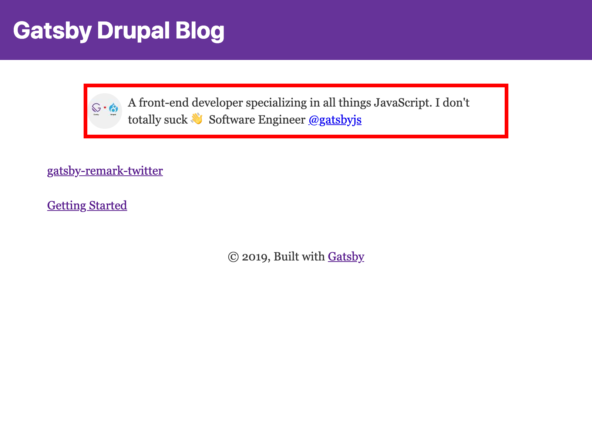

Whoo! Hopefully you're still around from the previous lab--that was a doozy!

In this lab, we're going to create a Bio component that we can re-use in several places. This Bio component will contain a brief description of who you are and what you do _and_ it will display an optimized version of your avatar--all from Drupal!

The first thing we will do is create the Bio page in Drupal.

## Creating the page in Drupal

<!-- TODO: show how to create a page with Drupal -->

## Creating the Bio React component

First things first... we need to create our React component!

```shell
touch src/components/bio.js
```

We will need to create a "shell" component, so create it initially with the following structure:

```jsx
import React from 'react'

export default function Bio() {
  return null
}
```

this won't render _anything_ to begin with, but soon enough we'll bring this to life!

## Creating the GraphQL query

In order to bring this component to life, we first need to craft the underlying query that gives this component data! Remember that GraphiQL (`http://localhost:8000/___graphql`) is _very_ helpful here!

What we will do is query for the `nodePage` by a unique identifier, perhaps a `title` ;) GraphQL has amazing built-in querying features to enable this type of functionality. For instance, if we had a page with a title of `About`, we could query it like so:

```graphql
{
  nodePage(title: { eq: "About" }) {
    title
  }
}
```

We will want to grab the `html` from the `childMarkdownRemark` and we'll also want to grab the featured image!

<details>
  <summary>Need a hint?</summary>

  ```graphql
  {
    bio: nodePage(title:{eq:"Bio"}) {
      relationships {
        field_image {
          relationships {
            field_media_image {
              localFile {
                # note the below is not supported in GraphiQL
                # but it will work in your React component!
                childImageSharp {
                  fixed(height:48) {
                    ...GatsbyImageSharpFixed
                  }
                }
              }
            }
          }
        }
      }
      fields {
        markdownBody {
          childMarkdownRemark {
            html
          }
        }
      }
    }
  }
  ```

</details>

## Using the GraphQL query

Now that we've written a query that retrieves a field image _and_ the html from the Markdown-powered bio, we can render this to a React component with Gatsby!

We are going to use a `StaticQuery`. A `StaticQuery` is special in that it doesn't accept variables and works in _any_ React component in our `src` directory, so it's a perfect use for our Bio component. For an example of how to use this, check out the below example:

```jsx
import React from 'react'
import { StaticQuery, graphql } from 'gatsby'

export default function Author() {
  return (
    <StaticQuery
      query={graphql`
        {
          site {
            siteMetadata {
              author
            }
          }
        }
      `}
      render={data => (
        <h1>{data.site.siteMetadata.author}</h1>
      )}
    />
  )
}
```

With this in mind, we will want to:

- Use a `StaticQuery` in `src/templates/bio.js`
- Pass the query to our React component
- Render this data in our React component
- Use the `gatsby-image` component to render a `fixed` image, e.g. consider the following example
    ```jsx
    import React from 'react'
    import { StaticQuery, graphql } from 'gatsby'
    import Image from 'gatsby-image'

    export default function Avatar() {
      return (
        <StaticQuery
          query={graphql`
            {
              file(relativePath: { regex: "/some-image.jpg/"}) {
                childImageSharp {
                  fixed(width: 48) {
                    ...GatsbyImageSharpFixed
                  }
                }
              }
            }
          `}
          render={data => (
            <Image fixed={data.file.childImageSharp.fixed} />
          )}
        />
      )
    }
    ```

<details>
  <summary>Need a little help?</summary>

  ```jsx
  import React from 'react'
  import { StaticQuery, graphql } from 'gatsby'
  import Image from 'gatsby-image'

  import styles from './bio.module.css'

  export default function Bio() {
    return (
      <StaticQuery
        query={graphql`
          {
            bio: nodePage(title:{eq:"Bio"}) {
              relationships {
                field_image {
                  relationships {
                    field_media_image {
                      localFile {
                        childImageSharp {
                            fixed(height:48) {
                              ...GatsbyImageSharpFixed
                            }
                          }
                      }
                    }
                  }
                }
              }
              fields {
                markdownBody {
                  childMarkdownRemark {
                    html
                  }
                }
              }
            }
          }
        `}
        render={data => (
          (
            <div className={styles.bio}>
              <Image className={styles.avatar} fixed={data.bio.relationships.field_image.relationships.field_media_image.localFile.childImageSharp.fixed} />
              <div className={styles.description} dangerouslySetInnerHTML={{ __html: data.bio.fields.markdownBody.childMarkdownRemark.html }} />
            </div>
          )
        )}
      />
    )
  }
  ```

</details>

At this point--you've hopefully been able to render a `fixed` image with `gatsby-image` and additionally render a bio description as HTML translated from Markdown. Neat!

We'd now like to actually _use_ this component in various pages, particularly we'd like to show it on our index route (above all blog posts) and on _each_ blog post, below the contents of the blog post.

## Re-using the reusable component

In React, you `import` components that you intend to re-use. For instance, if we have a `Header` component in `src/components/header.js`, we can _use_ this component like so in `src/components/layout.js`:

```jsx
import React from 'react'

import Header from './header'

export default function Layout({ children }) {
  return (
    <div>
      <Header />
      <main>{children}</main>
    </div>
  )
}
```

This core re-usable principle is one of the hallmarks of a well-structured React application. As such--let's re-use the `Bio` component we just created in the following places:

- `src/pages/index.js`
- `src/templates/article.js`

When you're done, you should see something like the following on the index page and the article template!


