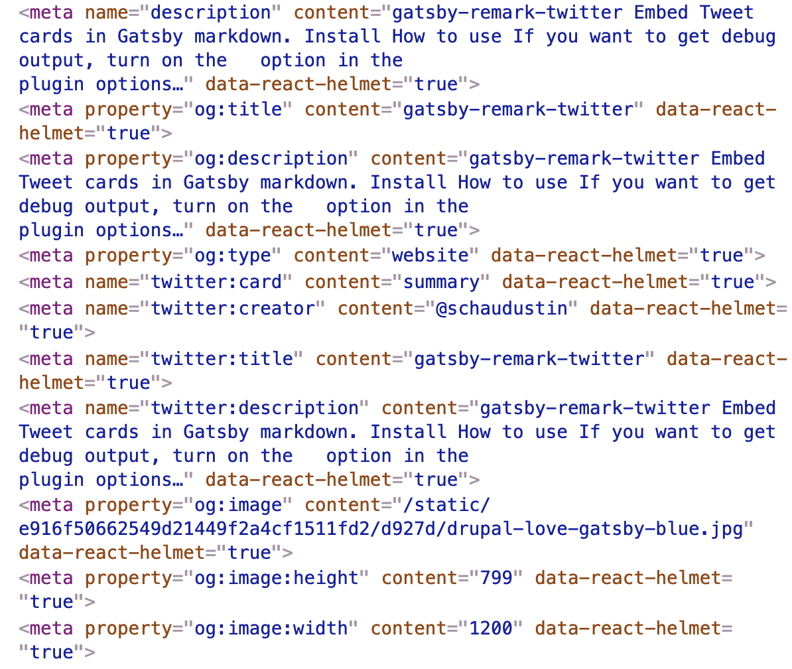

Search Engine Optimization (hereafter just "SEO") is an incredibly important aspect of modern web development to get correct. You want as many users as possible, and users typically get routed from search engines like Google and allegedly Bing.

From this perspective, we want to implement a solid SEO strategy for our blog. Primarily, we want to see traffic routed to our blog posts, so we'll spend most of our time optimizing those routes. Additionally, we want these to be shared on social networks like Twitter and Facebook, so we'll place special emphasis on optimizing "cards" for both. Let's do it!

## The `SEO` component

First - let's take a look at the existing SEO component and how it works. If you open up `src/components/seo.js` you can see a base component that implements rudimentary SEO techniques. This component takes a few props, specifically `title`, `description`, `keywords`, etc. It can also be easily extended with a `meta` property (as an array), where you can pass _whatever_ SEO tags you want directly.

The appealing part of this component, and Gatsby in general, is that these meta tags are rendered at _build time_ and do not require JavaScript to function. As such--merely by using Gatsby and this component, you can get incredibly robust SEO with very little effort. The dream!

Take a minute or two to see how this component is implemented, because now we'll actually _use_ this component.

## Using the `SEO` component

This SEO component is a regular React component, so it can be imported and used as any other. We'll be using this component in our `src/templates/article.js` component!

First things first, you'll want to import the `SEO` component like so:

```jsx
import SEO from '../components/seo'
```

Once it's available, we can render it in the body of our `BlogPost` component. Go ahead and render it with dummy data, e.g.

```jsx
<SEO title="A blog post" description="This is a blog post" />
```

Now we need to query a few things with GraphQL from our Drupal article.

## Crafting the SEO query

Specifically, we will want to query for the following, additional details:

- `title` (you may already have this!)
- `description` (note: `childMarkdownRemark` contains an `excerpt` field)
    ```graphql
    {
      childMarkdownRemark {
        excerpt(pruneLength: 160)
      }
    }
    ```
- A `featured_image`
    - This is provided by Drupal in _every_ article. See the sample query below for an example
    - Our previous example with the `Bio` component will be _very_ helpful here!

On the image in particular, note that there is a `resize` property of `childImageSharp` that is very helpful! Note that a recommended width is `1200` for general SEO purposes. Consider the following query if it's helpful!

```graphql
{
  file(relativePath: { regex: "/some-image.jpg/" }) {
    childImageSharp {
      resize(width: 1200) {
        src # this is an absolute path to the image
        width
        height
      }
    }
  }
}
```

Wrapping it all up, you'll use this SEO component with the following meta tags, passed as an array of objects:

|`property`|`content`|
|:--------:|---------|
|`og:image`|path to an image|
|`og:image:height`|height of an image (do not include `px`)|
|`og:image:width`|width of an image (do not include `px`)|

Once completed, test your SEO by inspecting the `head` tags with the browser devtools. They should look something like the below:



Once your output is similar to the above, Lab Four is completed! If extra time, consider improving SEO in other areas of the blogging application, as well, e.g. `src/pages/index.js` (could use an image for social sharing? an improved description? etc.)

On to the next one!
