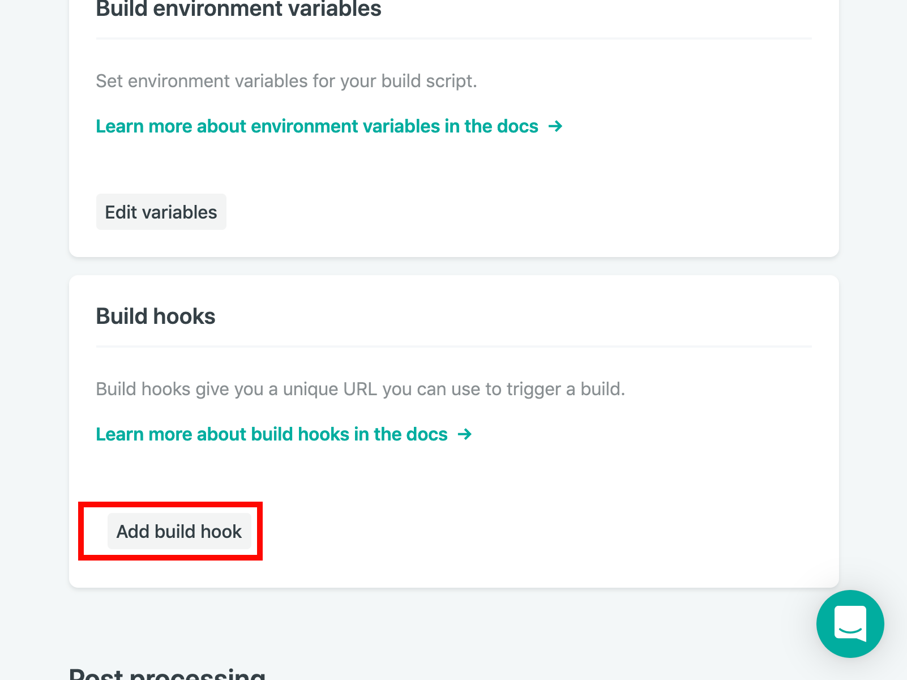

In this lab, all of our hard work will finally pay off. We can deploy to "production!"

We'll do so using Netlify. However--the nature of Gatsby and static generation implicitly means that we need to trigger a re-build _whenever_ content changes. We don't want to (manually) kick off a build whenever we add new content. In this lab, we'll use a Drupal web hook to trigger a Netlify re-build whenever content is changed (added, deleted, or tweaked!), so that our users can instantly see the latest copy of our excellent blog. Let's get to it!

## Setting up Netlify

Netlify is an excellent content host and CDN. It takes the manual work out of hosting--we just commit to our repo, and Netlify will re-build on every push and/or PR appropriately. Sweet!

Netlify has a config-as-code option that is especially helpful for a monorepo--like we currently have. Let's set up our config by modifying our `netlify.toml` file in the _root_ of the repo like so:

We'll want to deploy our lab-05 folder, but first we want to ensure that we're building out our lab-05 content. You'll want to modify the existing file to build out lab/05-deploying rather than the final version!

Once done, make sure you commit your changes to master (or merge them into master).

### Creating the Netlify instance

We now need to manually create the Netlify instance by syncing with our Github repo. We can do so using [Netlify's UI](https://netlify.com) and signing in using our GitHub account.

1. Log in
1. Press "New site from Git" in the upper right corner
   
1. Connect with GitHub
   
1. Search for and add your forked repository
1. Press "Deploy site"
1. Press "Site settings"
   - Feel free to change your site name here!
   - Do **make a note** of the deployed URL; we'll re-use it in a bit!
1. Configure environment variables in `Build & Deploy`
   - Because Netlify does not know about the environment variables stored in your `.env` files (and this is a good thing--we don't _want_ to commit these to source control!), we will need to add environment variables
   - We will want to expose the _same_ variable names and values as in our `.env.development` or `.env.production` file (these should generally be the same)

Once done, we will want to trigger a _new_ deploy (the first one should fail with missing variables!) and we _should_ be able to preview our new site! Woo hoo!!

However - we still want to trigger a re-build when content changes in our Drupal CMS. Netlify exposes a webhook we can trigger, so we now want to add a build hook in Netlify's UI.

### Adding a build hook

In `Build & deploy` we can now add a build hook. Press `Add build hook`



The name can be whatever you want, e.g. `Sync with Drupal` and you will want to build out the `master` branch. This will give you a unique url that you can `POST` to from a third party service like... Drupal! Make a note of this url and copy it somewhere.

### Adding the webhook to Drupal

We can now add a build hook that triggers a Netlify re-build. Using the toolbar:

1. Configuration -> System -> Build hook settings
1. In the `Build hook` text field, enter your saved build hook from Netlify
1. Be sure to add the appropriate triggers, e.g. Node updates
1. Press "Save configuration"

It should look something like this:


We have _one more thing_ to get set-up, and then the workshop is finished! The `og:image` property requires a path containing the _full_ URL, not just a path to an image. For instance, `<meta property="og:image" content="/path/to/image.jpg>` is invalid, but `<meta property="og:image" content="https://your-web-site.com/path/to/image.jpg>` is valid! Let's fix this to maximize our SEO and get that nice social sharing support, as well!

### Adding the siteUrl

If you open up `gatsby-config.js` you will see a `siteUrl` property. Change it to the deploy URL we grabbed earlier from Netlify.

Finally, if we open up `src/pages/article.js`, we can prepend the siteUrl to get the full URL.

<details>
  <summary>Need help grabbing the siteUrl?</summary>

```graphql
{
  site {
    siteMetadata {
      siteUrl # use this in the existing GraphQL query
    }
  }
}
```

</details>

You should end up with a `meta` tag set up that looks something like:


It's cool to validate, so once you push to master, Netlify will automatically build out a new deploy. Once that's finished, you can [validate your card on Twitter.](https://cards-dev.twitter.com/validator) Here's an example!


## Wrap up

You did it! We've created a fully functional blogging application that you can now extend, customize, and make your own. It is sourced from headless Drupal, and re-builds whenever content changes in our CMS. We've built out a _blazing fast_ application utilizing some great new technologies like React, GraphQL, and of course, Gatsby. We hope you enjoyed the workshop as much as we enjoyed creating and teaching it. Thank you! 💜
