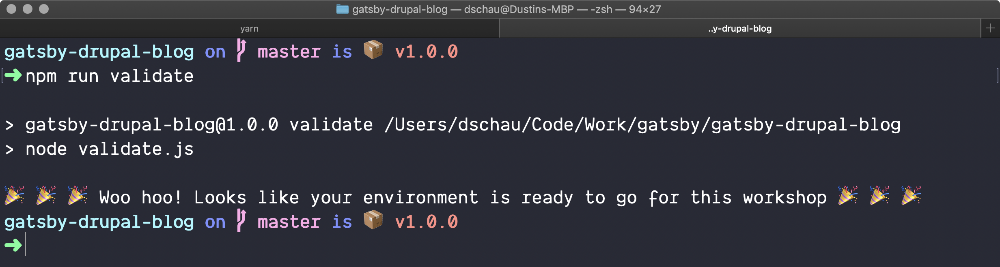

We are going to primarily be working in a [Github repo](https://github.com/dschau/gatsby-drupal-blog).

Prior to the workshop, we **highly** recommend running the validation step to ensure your machine will be best equipped to get up and running with Gatsby and Drupal.

## Requirements

- A GitHub account
- Several globally available dependencies, specifically:
    - `git`
    - `npm` (>= 5.0.0)
    - `yarn` (>= 1.0.0)

## Instructions

We include a helpful validation script, and we are going to use the forking/upstream model so that you can easily commit any changes/branches to your _personal_ copy of the labs.

1. Fork the repo to your personal account
    - We fork so that you can feel free to make commits/branches/etc. _and_ so that you can use this as a base in the future for your actual Gatsby app/blog!
    - Consider adding the upstream
        ```shell
        git remote add upstream https://github.com/dschau/gatsby-drupal-blog
        git fetch upstream master
        ```
1. Clone the forked repo
    ```shell
    git clone https://github.com/your-name/gatsby-drupal-blog labs
    cd labs
    ```
1. Run the validation script
    ```shell
    npm run validate
    ```

    - If any errors arise, they can be addressed by installing the specified version of the dependency (e.g. yarn, npm, etc.)
    - You should see the following
    
1. Come prepared to learn 🎉 You're ready for the labs and workshop!
