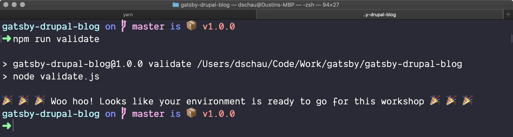

We are going to primarily be working in a [Github repo](https://github.com/dschau/gatsby-drupal-blog).

Prior to the workshop, we **highly** recommend running the validation step(s) below to ensure your machine will be best equipped to get up and running with Gatsby and Drupal.

## Requirements

- A GitHub account
- Several globally available dependencies, specifically:
  - `git`
  - `npm` (>= 5.0.0)
  - `yarn` (>= 1.0.0)
    - See [Why Yarn?](#why-yarn)

## Instructions

We include a helpful validation script, and we are going to use the forking/upstream model so that you can easily commit any changes/branches to your _personal_ copy of the labs.

1. Fork the repo to your personal account
   - We fork so that you can feel free to make commits/branches/etc. _and_ so that you can use this as a base in the future for your actual Gatsby app/blog!
   - Consider adding the upstream
     ```shell
     git remote add upstream https://github.com/dschau/gatsby-drupal-blog
     git fetch upstream master
     ```
1. Clone the forked repo
   ```shell
   git clone https://github.com/your-name/gatsby-drupal-blog labs
   cd labs
   ```
1. Run the validation script

   ```shell
   npm run validate
   ```

   - If any errors arise, they can be addressed by installing the specified version of the dependency (e.g. yarn, npm, etc.)
   - You should see the following
     

1. Come prepared to learn 🎉 You're ready for the labs and workshop!

## Why Yarn

Yarn has an excellent feature called [Yarn Workspaces](https://yarnpkg.com/lang/en/docs/workspaces/), which let us bootstrap a project with multiple folders easily and quickly. In fact, each lab is a standalone folder and project that contains its own unique dependencies and project structure. With NPM, we would have to run `npm install` in _each_ folder and Yarn Workspaces allows us to run this install step a _single_ time and have all dependencies available for each and every lab with that one command.

It is not strictly necessary, but do allot a few more minutes for each lab to install dependencies if you do not want to use Yarn.
